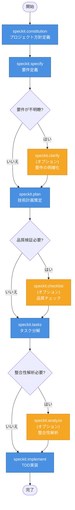

# jp-quant-playground

日本株のクオンツ戦略を実験するためのプレイグラウンド。ファンダメンタル指標を組み合わせて、市場を超えるリターンを目指すバックテスト環境。

## 📊 CSV出力列の詳細

yfinanceデータエクスポーターが出力する全32列の詳細情報です。

| 列名 | 区分 | 説明 | 関連指標 | 成長株投資 | 高配当株投資 | 割安株投資 |
|------|------|------|----------|------------|-------------|------------|
| **ticker** | 識別情報 | 証券コード（例：7203） | - | - | - | - |
| **stock_name** | メタデータ | 銘柄名（日本語） | - | - | - | - |
| **market_category** | メタデータ | 市場区分（プライム、スタンダード、グロース等） | - | ○ | - | - |
| **sector_33** | メタデータ | 33業種区分 | - | ○ | ○ | ○ |
| **sector_17** | メタデータ | 17業種区分 | - | ○ | ○ | ○ |
| **dividend_yield** | 配当指標 | 配当利回り（%）<br>年間配当金 / 株価 | payout_ratio | - | ◎ | ○ |
| **payout_ratio** | 配当指標 | 配当性向（%）<br>配当金 / 純利益 | dividend_yield | - | ◎ | ○ |
| **earnings_y0** | 利益データ | 当期純利益（直近年） | earnings_y1, y2 | ◎ | ◎ | ○ |
| **earnings_y1** | 利益データ | 当期純利益（前年） | earnings_y0, y2 | ◎ | ◎ | ○ |
| **earnings_y2** | 利益データ | 当期純利益（前々年） | earnings_y0, y1 | ◎ | ◎ | ○ |
| **consecutive_earnings_growth** | 利益データ | 3年連続増益フラグ<br>earnings_y0 > y1 > y2 | earnings_y0/y1/y2 | ◎ | ◎ | ○ |
| **trailing_pe** | バリュエーション | 実績PER（株価収益率）<br>株価 / 1株当たり利益 | peg_ratio, ev_ebit | - | ○ | ◎ |
| **psr** | バリュエーション | PSR（株価売上高倍率）<br>時価総額 / 売上高 | trailing_pe, peg_ratio | ○ | - | ◎ |
| **peg_ratio** | バリュエーション | PEGレシオ<br>PER / 利益成長率（%） | trailing_pe, earnings_growth | ◎ | - | ◎ |
| **market_cap** | 財務データ | 時価総額（円） | enterprise_value | ○ | ○ | ○ |
| **total_cash** | 財務データ | 現金及び現金同等物（円） | total_debt, net_cash_ratio | - | ○ | ○ |
| **total_debt** | 財務データ | 有利子負債合計（円） | total_cash, enterprise_value | - | ○ | ○ |
| **total_assets** | 財務データ | 総資産（円） | book_value, gross_profitability | - | ○ | ○ |
| **book_value** | 財務データ | 株主資本（自己資本）（円） | pbr, total_assets | - | ○ | ◎ |
| **operating_cash_flow** | 財務データ | 営業キャッシュフロー（円） | capex, fcf_yield, ev_fcf | ○ | ◎ | ◎ |
| **capex** | 財務データ | 設備投資額（資本的支出）（円）<br>※通常は負の値 | operating_cash_flow, fcf_yield | - | ○ | ○ |
| **ebit** | 財務データ | EBIT（利払い・税引き前利益）（円） | ev_ebit, net_income | ○ | ○ | ○ |
| **gross_profit** | 財務データ | 売上総利益（円） | gross_profitability, total_revenue | ○ | ○ | ○ |
| **net_income** | 財務データ | 当期純利益（円） | earnings_y0, trailing_pe | ◎ | ◎ | ○ |
| **total_revenue** | 財務データ | 売上高（円） | psr, gross_profit | ○ | ○ | ○ |
| **earnings_growth** | 財務データ | 利益成長率（小数、0.15=15%） | peg_ratio, consecutive_earnings_growth | ◎ | ○ | ○ |
| **net_cash_ratio** | 計算指標 | ネットキャッシュ比率<br>(現金 - 負債) / 時価総額 | total_cash, total_debt | - | ◎ | ◎ |
| **enterprise_value** | 計算指標 | 企業価値（EV）<br>時価総額 + 純有利子負債 | market_cap, total_debt, total_cash | - | - | ○ |
| **gross_profitability** | 計算指標 | 売上総利益率<br>売上総利益 / 総資産 | gross_profit, total_assets | ○ | ○ | ◎ |
| **fcf_yield** | 計算指標 | FCF利回り<br>フリーCF / 時価総額 | operating_cash_flow, capex | ○ | ◎ | ◎ |
| **pbr** | 計算指標 | PBR（株価純資産倍率）<br>時価総額 / 株主資本 | book_value, market_cap | - | ○ | ◎ |
| **ev_ebit** | 計算指標 | EV/EBIT倍率<br>企業価値 / EBIT | enterprise_value, ebit | - | - | ◎ |
| **ev_fcf** | 計算指標 | EV/FCF倍率<br>企業価値 / フリーCF | enterprise_value, fcf_yield | - | ○ | ◎ |

### 凡例

- **成長株投資**: ◎ 非常に有用 / ○ 有用 / - 関連性低い
- **高配当株投資**: ◎ 非常に有用 / ○ 有用 / - 関連性低い
- **割安株投資**: ◎ 非常に有用 / ○ 有用 / - 関連性低い

### 区分の説明

- **識別情報**: 銘柄を一意に識別するための情報
- **メタデータ**: 銘柄の属性情報（名称、市場、業種）
- **配当指標**: 配当投資・インカムゲイン戦略に使用
- **利益データ**: 利益成長トレンドの把握に使用
- **バリュエーション**: 株価の割高・割安判断に使用
- **財務データ**: yfinanceから直接取得した生データ
- **計算指標**: 財務データから計算した高度な投資指標

## 🚀 クイックスタート

### 環境セットアップ

```bash
# 依存関係のインストール
uv sync
```

### データエクスポート

```bash
# 全銘柄（個別株のみ、約4,000銘柄）をエクスポート
uv run python -m note.scripts.export_stock_data

# 最初の100銘柄のみエクスポート（テスト用）
uv run python -m note.scripts.export_stock_data --limit 100

# ETF/ETNも含めてエクスポート
uv run python -m note.scripts.export_stock_data --include-etf

# カスタム入力ファイル・出力先を指定
uv run python -m note.scripts.export_stock_data \
  --input path/to/tickers.tsv \
  --output path/to/output/
```

### 出力ファイル

デフォルトで `note/data/exports/stock_data_YYYYMMDD_HHMMSS.csv` に保存されます。

## 📈 投資戦略の例

### 高配当株スクリーニング

以下の条件でフィルタリング：
- `dividend_yield >= 0.04` (配当利回り4%以上)
- `payout_ratio < 0.6` (配当性向60%未満、配当余力あり)
- `consecutive_earnings_growth == True` (3年連続増益)
- `net_cash_ratio > 0` (ネットキャッシュ、財務安全)

### 割安成長株スクリーニング

以下の条件でフィルタリング：
- `peg_ratio < 1.0` (PEGレシオ1未満、成長性に対して割安)
- `pbr < 1.5` (PBR1.5未満)
- `ev_ebit < 10` (EV/EBIT 10倍未満)
- `earnings_growth > 0.1` (利益成長率10%以上)
- `gross_profitability > 0.35` (売上総利益率35%以上、高収益性)

### バリュー株スクリーニング

以下の条件でフィルタリング：
- `trailing_pe < 15` (PER15倍未満)
- `pbr < 1.0` (PBR1倍未満、解散価値以下)
- `fcf_yield > 0.05` (FCF利回り5%以上)
- `net_cash_ratio > 0.1` (ネットキャッシュ比率10%以上)
- `ev_ebit < 8` (EV/EBIT 8倍未満)

## 🛠 開発

### コード品質チェック

```bash
# リンター実行
uv run ruff check .

# フォーマット実行
uv run ruff format .

# インポート整理
uv run isort .
```

## 📚 詳細ドキュメント

詳細な開発ガイドラインは [CLAUDE.md](./CLAUDE.md) を参照してください。

## 📄 ライセンス

このプロジェクトは個人的な実験・学習目的で作成されています。

## Speckit

